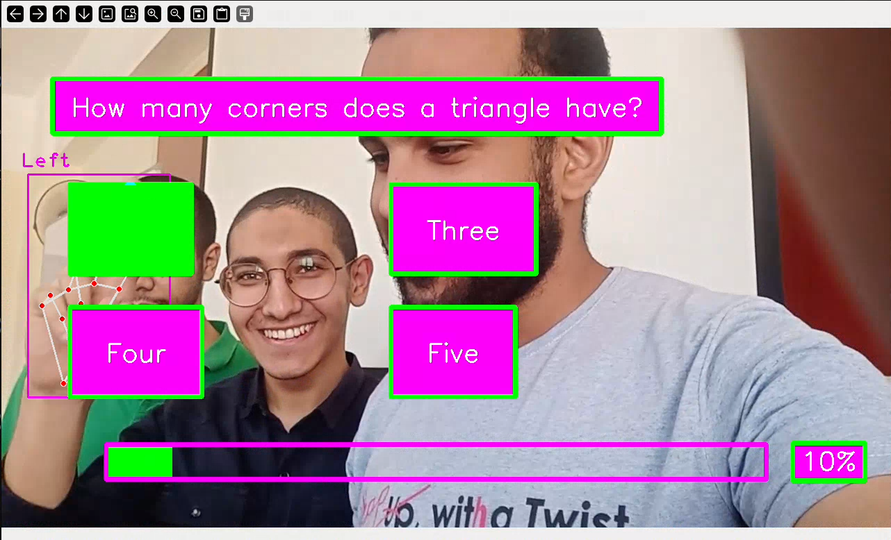

# Quiz Game
This app is a pattern recognition and image process application.

Quiz game that utilizes webcam interaction for answer selection. The user raises their hand in front of the webcam to point towards the chosen answer choice.

## Table of content
- [Quiz Game](#quiz-game)
  - [Table of content](#table-of-content)
  - [About](#about)
  - [Built With](#built-with)
  - [Prerequisites:](#prerequisites)
  - [Get started](#get-started)
  - [Gameplay](#gameplay)
  - [Contributors](#contributors)

## About
This is app is based on OpenCv a real time computer vision library, MediaPipe a framework for building pipelines to perform computer vision inference over arbitrary sensory data such as video or audio, and cvzone for detecting hands.

**Concept**

The game presents users with multiple-choice questions (MCQs) related to patterns. The user interacts with the game by raising their hand in front of the webcam and pointing towards the answer choice they believe is correct. The webcam feed is processed to detect the user's hand position and determine the chosen answer.

## Built With
* [OpenCV (cv2)](https://opencv.org/): Provides fundamental image and video processing capabilities.
* [MediaPipe (mediapipe)](https://github.com/google/mediapipe): Likely used for more advanced hand pose estimation or gesture recognition.
* [cvzone](https://github.com/cvzone/cvzone): A computer vision library that might offer functionalities for simplifying hand detection or user interaction tasks within OpenCV. You can search for more information about cvzone online. 

## Prerequisites:
* Python (version to be specified)
* [OpenCV library (cv2)](https://opencv.org/)
* [MediaPipe (mediapipe) library](https://github.com/google/mediapipe)
* [cvzone](https://github.com/cvzone/cvzone)
* Additional libraries may be required based on the chosen development framework (e.g., TensorFlow for machine learning aspects)

## Get started
1. **Setting Up:**
    * Clone this repository or download the project files.
    * Install the required libraries using `pip install <library_name>`.
    * Configure the development environment (IDE or code editor) according to your preference.

2. **Running the Game:**
    * use `python main.py` or `python3 main.py` according on python version on your machine

## Gameplay
* The game will display an MCQ on the screen.
* The user will see answer choices visually represented (e.g., text labels, images).
* By raising their hand and pointing towards the desired answer on the screen, the user selects their choice.
* The webcam will detect the hand movement and identify the chosen answer.
* The game will provide feedback based on the user's selection (correct/incorrect).
* The game may offer options to progress to the next question, restart the quiz, or exit.

## Contributors:

* [Mohamed Ali](https://github.com/MohamedAli00949)
* [Mohamed Khalid](https://github.com/mohamedtsx)
* [Mohamed Nabil](https://github.com/muhmmadnabil)
